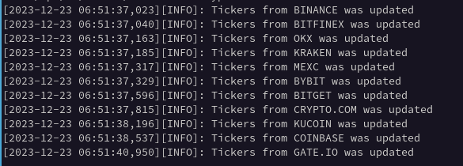
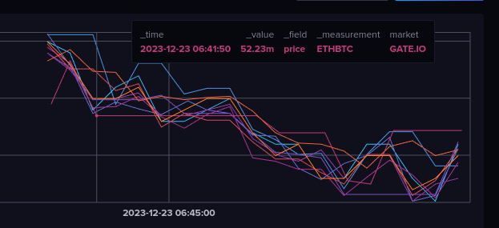

## Introduction
For GIT (Github) testing only! __Arbitr__ planned as tool for arbitration on a many Crypto exchanges once. What is the Crypto arbitrage? [Here is explanation from Kraken](https://www.kraken.com/ru-ru/learn/trading/crypto-arbitrage) 

Current Crypto exchanhes was added:
- Binance;
- OKX;
- Bybit;
- Kraken;
- Coinbase;
- Gate.io;
- Kucoin;
- Bitfinex;
- Mexc;
- Bitget
- Crypto.com;

Unfortunately, some Crypto exchanes or their API's are not available for me :(
## Current Releases
__0.1__ - Initial commit. At this moment I just want to try add more Crypto exchanes as possible. Now here is 11 Crypto exchanges total; 
## Platforms
Tested on a Fedora Workstation 39. `Python3.11` used. `Python3.12` or newer not suitable due to Python's package __setuptool__ incompatibility. At least in a Fedora Workstation 39. When it is possible, packages from Crypto exchanges used. Here they are:
- `python-binance`
- `python-okx`
- `pybit`
- `gate-api`

You need to install them like this:
> *pip3.11 install python-binance python-okx pybit gate-api*

When package usage not possible or there is no package available, __requests__ library used. 
Application required  __Influxdb__ as storage, so, you need to install `influxdb_client`:
> *pip3.11 install influxdb_client*
## Usage
Place your Crypto exchange's keys and secrets to config and just launch it!  
Typical launch:
> *python3.11 arbitr.py*

  That indicates everything is going ok. By default, log saved to file. You can change this, edit `app_log_to_file` variable in `config.py`. __Coinbase__ exchange does not have API call, that return all tickers at once. You can edit list of base currencies in a config.py.

## Plans
 - Add more Crypto exchanges as possible;
 - Add Crypto pairs correspondence between different Crypto excanges;
 - Divide workers (separate script for every crypto exchange)? Better way to handle errors, exceptions, improves, etc;
 - Add my own charts, now built-in Inluxdb charts are used:
 
 - Finally, add analytics to know most profitable Crypto pairs. That's the point;
## Licenses
Use and modify on your own risk.